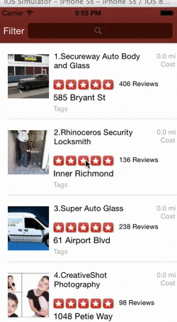

<h1>Required Tasks:</h1>

<h2>Search</h2>
<ul>
<li>Table rows should be dynamic height according to the content height<\li>
<li>Custom cells should have the proper Auto Layout constraints<\li>
<li>Search bar should be in the navigation bar (doesn't have to expand to show location like the real Yelp app does).<\li>
</ul>
 
<h2>Filter</h2>
<ul>
<li> The filters you should actually have are: category, sort (best match, distance, highest rated), radius (meters), deals (on/off).</li>
<li> The filters table should be organized into sections as in the mock.</li>
<li> You can use the default UISwitch for on/off states. Optional: implement a custom switch</li>
<li> Radius filter should expand as in the real Yelp app</li>
<li> Categories should show a subset of the full list with a "See All" row to expand. </li>
<li> Clicking on the "Search" button should dismiss the filters page and trigger the search w/ the new filter settings.</li>
</ul>

Time Spent: 30 hours 

